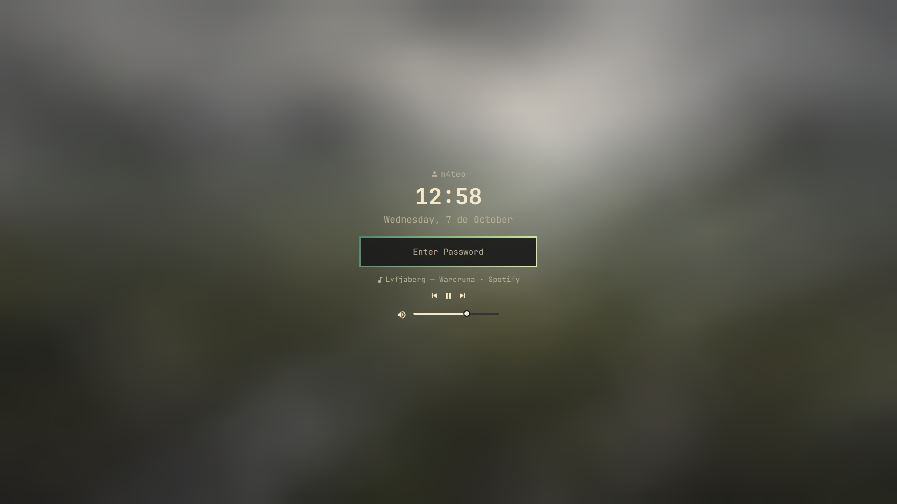

# Lock Screen

A lock screen for the Omarchy shell built on Quickshell's session lock: separate
password and fingerprint PAM flows, blurred wallpaper, wall clock, currently
playing media (Spotify-first, anything with MPRIS), and a volume slider.



## Features

- Session lock via `ext-session-lock` (fails safe behind the compositor).
- Password (`PAM`) and fingerprint authentication flows.
- Blurred, contrast-adjusted wallpaper from the current Omarchy background.
- Clock + date, centered over the password field.
- Current track (title — artist · player) via MPRIS, Spotify preferred, with
  previous / play-pause / next controls showing only when supported.
- Volume slider + mute toggle (Pipewire default sink).
- Right-click on the preview surface dismisses it (see below).

## Requirements

- Omarchy with the **Quattro** shell (Quickshell).
- `PAM` service `omarchy-lock-password` at `/etc/pam.d/omarchy-lock-password`.
- Optional fingerprint: `/etc/pam.d/omarchy-lock-fingerprint` + `fprintd`.
- Pipewire (`wpctl`) for the volume slider.

## Install

    omarchy plugin add https://github.com/archlatam/omaarch.lock --enable
    omarchy restart shell

`--enable` does not restart the shell; until the restart the plugin is
installed but not active. Enabling the plugin automatically disables Omarchy's
built-in lock (`omarchy.lock`) — the manifest declares
`"omarchy": {"clonedFrom": "omarchy.lock"}`, so `omarchy plugin enable` adds it
to `disabledPlugins[]` in `shell.json` for you. Disabling or removing this
plugin restores the built-in lock. Omarchy names the install directory after
the plugin id: `~/.config/omarchy/plugins/io.github.archlatam.lock/`. If you
ever change the id, update the matching `"id"` entry in
`~/.config/omarchy/shell.json` (`plugins`), or the service silently
disappears.

## Update

    omarchy plugin update io.github.archlatam.lock

No `omarchy restart shell` needed here: the shell watches plugin directories
and reloads a changed one by itself. That covers _edits_ to a plugin that is
already loaded. A plugin installed for the first time does need a restart,
because neither `add` nor `enable` restarts the shell themselves.

`omarchy plugin update` with no argument updates every git-managed plugin at
once.

## Uninstall

    omarchy plugin remove io.github.archlatam.lock

That deletes the plugin from `~/.config/omarchy/plugins/`. One thing worth
knowing: the PAM configs `/etc/pam.d/omarchy-lock-password` and
`/etc/pam.d/omarchy-lock-fingerprint`, plus `fprintd` if you enrolled a
fingerprint, are system files and stay installed — remove them by hand if you
don't want them anymore.

## Usage

```bash
# preview without locking the session
omarchy-shell lock preview
omarchy-shell lock hidePreview

# status
omarchy-shell lock status
```

Test click, fingerprint/password flows, `Escape`, shell restart, disable/remove
before publishing.
